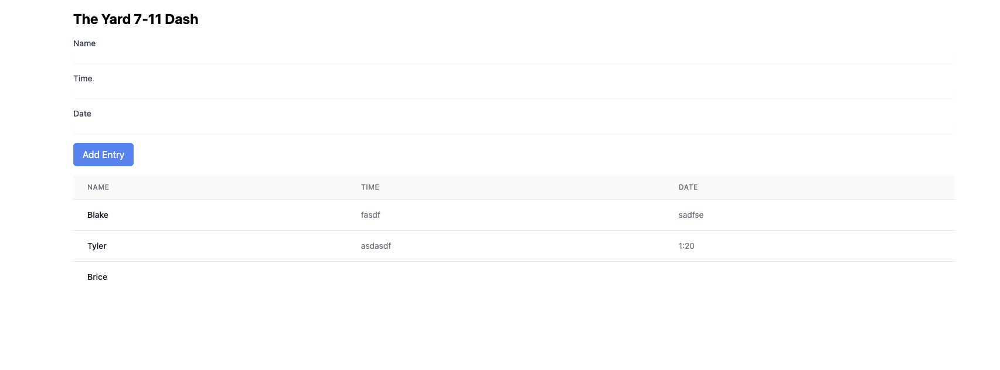

# The Yard 7-11 Dash

Are you brave enough to complete the 7-11 Dash? 🏃‍♂️🏃‍♀️

## Development Jouney

### Initial Project Set-Up

For the fastest development process, I knew that I wanted to use React with Typescript and TailwindCSS for easy styling. Normally, I would make a single page application using Angular because I am most familiar with it and have my own template for creating an Angular project with Typescript, TailwindCSS, and Firebase. However, I wanted to try something new and I have been wanting to learn React for a while now. This repository laid out the foundation for the project: [Ikeawesom's React Tailwind TS Boilerplate - Github](https://github.com/ikeawesom/react-tailwind-ts-boilerplate/tree/main). Using this repository was as simple as cloning it, replacing all of the boilerplate text with my project's name, and then running `npm install` to install all of the dependencies.

Next, I wanted to use firebase for a quick way to store data and host my application. I followed the steps to create a new firebase project in my web browser. Once that was complete, I installed the firebase CLI and ran `firebase init` in the root of my project. I selected the options to set up hosting, firestore, and function (just in case I need it in the future and want to support emailing alerts or whatnot). Also during this step, I was able to set-up Github actions to automatically deploy my project to firebase hosting whenever I push to the main branch. This was a huge time saver and I am very happy with how easy it was to set up.

In the firebase browser, I created a new firestore database and set up the rules to allow anyone to read and write to the database. This is not secure, but it is fine for now because I am the only one working on this project and I will change the rules later on. Additionally, I registered a new web app in the firebase console and copied the configuration object to my project's `.env` file. This is how I will connect to my firebase project.

### Proof of Concept CRUD Operations

#### Firebase Configuration

The first challenge in this step was to create a configuration file for firebase. I ran `npm install firebase` to install the firebase package and then created a new file in the `src` directory called `firebase.tsx`. This file exports a `firebase` object which is initialized with the configuration object from the `.env` file. This object also exports the `firestore` object which is initialized with the firebase object. This is how I will interact with the firestore database.

#### Types and Service Files

In the spirit of typescript and enforcing some structure for my NoSQL database, I created an interface in the `src/types` directory called `time-entry.types.ts`. From this point forward, I will be using this interface anytime I am creating, updating, or reading a time entry in the database:

```typescript
export default interface ITimeEntry {
    id?: string | null,
    name: string,
    date: string,
    time: string,
}
```

To interact with the database, I created a new file in the `src/services` directory called `time-entry.service.ts`. For the proof of concept, I only created 2 functions: `getAllTimeEntries` and `addTimeEntry` (Not quite CRUD yet but we're working on it). This file uses the firestore object from the `src/firebase.tsx` file to interact with the database:

```typescript
import { firestore, TIME_ENTRY_COLLECTION } from "../firebase";
import { collection, getDocs, addDoc } from "firebase/firestore";
import ITimeEntry from "../types/time-entry.types";

const timeEntriesCollection = collection(firestore, TIME_ENTRY_COLLECTION);

export const addTimeEntry = async (entry: Omit<ITimeEntry, 'id'>): Promise<void> => {
    try {
      await addDoc(timeEntriesCollection, entry);
    } catch (error) {
      console.error('Error adding time entry: ', error);
    }
};  

export const getAllTimeEntries = async (): Promise<ITimeEntry[]> => {
    try {
        const snapshot = await getDocs(timeEntriesCollection);
        const entries: ITimeEntry[] = snapshot.docs.map(doc => ({
          ...doc.data()
        })) as ITimeEntry[];
        return entries;
    }
    catch (error) {
        console.error("Error getting documents: ", error);
        return [];
    }
};
```

After writing this function, I see that there is a lot of repeated code. I will refactor this later on to make it more DRY. A DB service file should be able to handle any type of object and not be specific to a single object, provide robust error handling, and create a single place to update the names of collections in my database as I create them.

#### Implementing frontend

Now it was time to put my new service file and type to use to see if I could display information from firestore in my react application. For this proof of concept, I added everything to the `App.tsx` file with the idea that later I would break complex topics into components and have a better way of handling state.

There are 2 main functionalities of the application at this point:

- Display all time entries in a table
- Add a new time entry to the database

##### Displaying Time Entries

To display all time entries in a table, I created a new state variable called `entries` which is an array of `ITimeEntry` objects. I then used the `useEffect` hook to fetch all time entries from the database when the component mounts. This is where I call the `getAllTimeEntries` function from the `time-entry.service.ts` file. I then set the state of the `entries` variable to the array of time entries that I fetched from the database.

```typescript
const [entries, setEntries] = useState<ITimeEntry[]>([]);

useEffect(() => {
    const fetchEntries = async () => {
        const fetchedEntries = await getAllTimeEntries();
        setEntries(fetchedEntries);
    };
    fetchEntries();
}, []);
```

##### Adding Time Entries

When adding a new time entry, I need to create a form that will take in the name, date, and time of the entry. For the proof of concept, there will be no input validation and for further simplicity, all values are stored as a string. The default value for the state of the form is an `ITimeEntry` object with empty strings for the name, date, and time.

When the form is changed, the `handleChange` hook will update the state of the form:

```typescript
const [newEntry, setNewEntry] = useState<Omit<ITimeEntry, 'id'>>({
    name: '',
    date: '',
    time: ''
});

const handleChange = (event: React.ChangeEvent<HTMLInputElement | HTMLTextAreaElement>) => {
    const { name, value } = event.target;
    setNewEntry((prevEntry) => ({
        ...prevEntry,
        [name]: value
    }));
};
```

When the form is submitted, the `handleSubmit` function will be called. This function will prevent the default behavior of the form, create a new `ITimeEntry` object with the values from the form, and then call the `addTimeEntry` function from the `time-entry.service.ts` file to add the entry to the database. At this time I also perform a fetch of all entities in the database so that it is displayed in the table without a refresh. Items can be added one-at-a-time so I will need to find a way to make this fetching more effective or rearchitect the table state management.

```typescript
const handleSubmit = async (event: React.FormEvent) => {
    event.preventDefault();
    await addTimeEntry(newEntry);
    const updatedEntries = await getAllTimeEntries();
    setEntries(updatedEntries);
    setNewEntry({
        name: '',
        date: '',
        time: ''
    });
};
```

#### The Result

The result is a simple web application that displays all time entries in a table and allows the user to add a new time entry to the database. The table is not styled and the form is not validated, but the proof of concept is complete. The next steps will be to refactor the code to make it more maintainable and to add the ability to update and delete time entries.



#### References - My journey through tutorial hell

To complete this step, there are numerous sites that I referenced to help me understand how to interact with firestore using the firebase package and deepen my knowledge of React. The first thing I noticed was that Google's official documentation for firebase did not use typescript and I wanted to see how other dev's altered their file structure to make it more readable and maintainable. Here are some of the resources I used:

- [Firebase Official Documentation](https://firebase.google.com/docs/web/setup#available-libraries)
- [TypeScript in React – How to Manage State with Firebase Cloud Firestore (Olasunkanmi Balogun)](https://www.freecodecamp.org/news/how-to-manage-state-in-react-apps-with-firebase-cloud-firestore/)
- [Using Firestore with Typescript (Jamie Curnow)](https://medium.com/swlh/using-firestore-with-typescript-65bd2a602945)
- [react-firestore-crud-app-ts (awran5)](https://github.com/awran5/react-firestore-crud-app-ts/tree/main)
- [cra-template-typescript-firebase(pettiboy)](https://github.com/pettiboy/cra-template-typescript-firebase/tree/main)


### Refining Add Time Entry Modal

- [Creatying a simple Mopdal Component (Sanjana Kumari)](https://dev.to/theedgebreaker/creating-a-simple-modal-component-in-react-with-typescript-for-beginners-42ac)
- [reusable-modals-react-ts (ijaviertovar)](https://github.com/ljaviertovar/reusable-modals-react-ts)

## What I learned

### Naming Conventions and File Structure

One thing that always made me hesistant to work with react is my lack of knowledge on the best practices for file management and naming conventions. Opposed to Angular, React seems to provide more flexability when it comes to how your project is configured. I wanted to ensure that my structure was readable, well-documented, and easy-to-maintain so that my Computer Science roommate or other CS friends who participated in the challenge could make tweaks as needed.

### Managing States

The benefit of firestore is that it allows for real-time updates to the database. This means that I can listen to changes in the database and update my application accordingly. This was a huge benefit because I was able to see changes to the table in my web-app after adding an entry without refreshing the page. However, it was difficult to find a solution that did not fetch all entries from the database every time a change was made. I will need to research more on how to handle this in the future.